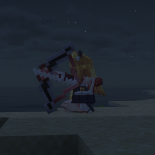

[English](README_EN.md) | [简体中文](README.md)
# TML_Avaritia_addon



> A small addon that lets Touhou Little Maid maids actually wield the weapons and armor of Re:Avaritia.

| Item | Value |
|---|---|
| Current Version | 0.1.4 |
| Loader | NeoForge 1.21.1 (21.1.248+) |
| Java | 21 |
| License | MIT |

---

## Features

### Melee
- **Infinity Sword**: Triggers Infinity Sword effects (instant kill + AOE). TLM's built-in attack task does not trigger this addon's effects.
### Ranged
- **Infinity Bow**: Fires without consuming backpack arrows; fires **Heaven Arrows** by default, or **Tracer Arrows** with Tracking Mode enabled.
- **Infinity Crossbow**: Fires a single **Heaven Arrow** by default, or a **5-arrow spread** with Multi-Shot Mode enabled.
- **Infinity Trident**: Throws the Infinity Trident and triggers **lightning strikes**.

> Each Infinity weapon task only accepts its corresponding Infinity weapon; with normal bows/crossbows/tridents these tasks will not attack. TLM's built-in bow/crossbow/trident tasks do not trigger this addon's effects.

### Weapon Mode Switch GUI
- A dedicated "Weapon Attack Mode Switch" task settings GUI for the bow/crossbow, used to toggle Tracking / Multi-Shot modes.
- Mode data is written to the weapon's NBT as `{mode:{...}}`, consistent with the vanilla Avaritia mode system.

### Infinity Armor – Maid Passive Adaptation
- **Full set**: Wearing the full Infinity Armor grants complete damage immunity (all damage is canceled, including Infinity weapon damage)
- **Helmet**: Night vision (configurable) + Water breathing
- **Chestplate**: Continuously removes negative effects
- **Leggings**: Fire resistance
- **Boots**: Step height 1.0625 (can walk up 1 block) + movement speed bonus (implemented via a `MOVEMENT_SPEED` attribute modifier; takes effect immediately on equip/unequip without interfering with the maid's AI pathfinding)
- Movement speed / swimming / sprinting multipliers are all configurable.

---

## Requirements

| Item | Version |
|---|---|
| Minecraft | 1.21.1 |
| NeoForge | 21.1.248+ |
| Java | 21 |
| Touhou Little Maid | 1.5.3 (NeoForge 1.21.1) |
| Re:Avaritia | 1.4.1 (1.21.1) |

> Both the client and the server must have this mod and both prerequisites installed. **If any prerequisite is missing, NeoForge will raise an error during startup and refuse to load this mod.**

> **Regarding Avaritia compatibility**: This mod is **adapted specifically for the "Re:Avaritia" branch only**, and does not represent compatibility with other Avaritia branches.

---

## Loader & Version Compatibility

| Loader | Status |
|---|---|
| NeoForge 1.21.1 (21.1.248+) | ✅ Fully supported (the development and test environment of this branch) |
| Forge | ❌ Not supported (Forge has no 1.21.1 branch; for 1.20.1 see the legacy release) |

---

## Installation

1. Install Minecraft 1.21.1 + NeoForge 21.1.248+ (see "Loader & Version Compatibility")
2. Install the prerequisites: Touhou Little Maid 1.5.3 (NeoForge 1.21.1), Re:Avaritia 1.4.1+ (1.21.1)
3. Place this mod's jar into the `mods/` folder
4. Launch the game

---

## Configuration

The config file is located at `config/tml_avaritia_addon-common.toml`. Main options:

| Key | Default | Description |
|---|---|---|
| `maid_sword_aoe` | `true` | Whether each Infinity Sword attack also triggers Re-Avaritia's right-click AOE (on by default) |
| `force_kill_mode` | `false` | Force the maid's Infinity Sword AOE into kill mode (off by default; AOE ignores friend/foe when enabled) |
| `infinity_armor_night_vision` | `true` | Infinity Armor helmet: night vision |
| `boot_speed_base` | `0.1` | Infinity boots speed (≈ 2× the maid's base movement speed, same multiplier as a player wearing the boots) |
| `boot_speed_swimming_multiplier` | `1.2` | Boots swimming multiplier |
| `boot_speed_sprinting_multiplier` | `0.2` | Boots sprinting multiplier (TLM maids don't sprint by default, so this stays dormant) |

> `boot_speed_flying/sneaking/backward/strafing_multiplier` are kept only to mirror Re-Avaritia's config; they are currently unused.

---

## Building from Source

Requirements: JDK 21

```bash
# Prerequisite dependencies are downloaded automatically from Modrinth Maven; no manual jar preparation needed.
# To use local jars instead, run ./gradlew -PuseLocalDeps build and put the two prerequisite jars into libs/
# (libs/ is gitignored and not committed)

./gradlew build        # Build output: build/libs/TML_Avaritia_Addon-<version>-MC1.21.1+NeoForge.jar
./gradlew runClient    # Launch the dev client
./gradlew runServer    # Launch the dev server
```

---

## Known Limitations

- **Thrown tridents are not retrieved**: An Infinity Trident thrown by a maid won't auto-return like a player's (`loyalty` doesn't work for maids); it sticks into the ground on hit.
- **Some player-only effects don't apply to maids** (e.g., the trident's Conduit Power mode, etc.).
- **The sprint multiplier is wired into the logic**, but TLM maid AI never sets sprinting, so this multiplier is dormant by default.

---

## License & Credits

This mod's code is released under the **MIT License**, Copyright © 2026 qinmadara. See [LICENSE](LICENSE).

This mod depends on and references the following open-source projects:

| Project | License | Copyright |
|---|---|---|
| [Touhou Little Maid](https://github.com/tartaricacid/TouhouLittleMaid) | Code: MIT / Assets: CC BY-NC-SA 4.0 | © tartaric_acid |
| [Re:Avaritia](https://github.com/Nova-Committee/Re-Avaritia) | Code: MIT / Assets: CC BY-NC-SA 4.0 | © cnlimiter (Nova Committee) |

- This mod only references the public APIs of the above mods at compile/runtime time and **does not bundle any of their code or assets**.
- This mod is an **unofficial addon** and is not affiliated with the authors of Touhou Little Maid or Re:Avaritia.

---

## AI Disclosure

- This mod was developed with **extensive AI assistance**, including: code generation and refactoring, bug triage, code review, and documentation (including this README).
- All AI-generated code was **reviewed, revised, and tested in-game by a human** before being integrated; the final code is released under the MIT License.
- AI is used to improve development efficiency; code quality, functional correctness, and license compliance are the responsibility of the project author.